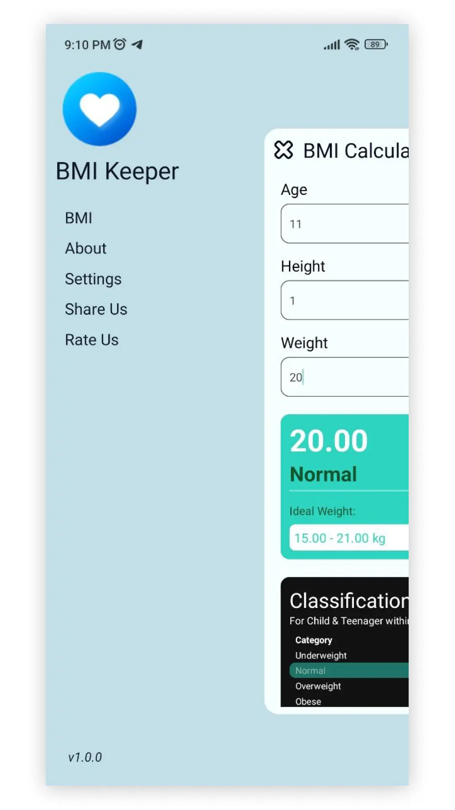

# BMI Keeper

BMI Keeper is a simple and user-friendly app that helps you calculate your Body Mass Index (BMI) and percentile from age 2 to 20. Based on Centers for Disease Control and Prevention data, the app provides accurate and reliable results for both males and females. 

With support for Hindi, English, and Bengali languages, you can use the app in the language of your choice. The app also features Light, Dark, and Device theme options, allowing you to customize your experience based on your preferences. Keep track of your health with BMI Keeper today.


# Features
- [x] Calculate your BMI and percentile accurately and quickly
- [x] Supports age range from 2 to 20 years old
- [x] Male and female options available
- [x] Available in Hindi, English, and Bengali languages
- [x] Light, Dark, and Device theme options for a personalized experience
- [x] Easy-to-use interface
- [x] Reliable results based on Centers for Disease Control and Prevention data
- [x] Minimal and user-friendly design
- [x] No ads for a seamless experience
- [x] No data collection, all data stored locally on the device

# Preview and Screenshots

| Application  | Preview |
| --- | --- |
|  |  | 
|  |  | 


## Available Units for Height:
- Centimeter (`cm.`)
- Meter (`m.`)
- Foot (`ft.`)
- Inch (`in.`)

## Available Units for Weight:
- Kilogram (`kg.`)
- Pounds (`lbs.`)

## Project Dependencies

### [package.json](./package.json)

```json
  "dependencies": {
    "@react-native-async-storage/async-storage": "^1.18.1",
    "@react-native-picker/picker": "^2.4.10",
    "@react-navigation/native": "^6.1.6",
    "@react-navigation/native-stack": "^6.9.12",
    "@react-navigation/stack": "^6.3.16",
    "i18next": "^22.4.15",
    "react": "18.2.0",
    "react-i18next": "^12.2.2",
    "react-native": "0.71.6",
    "react-native-quick-actions": "^0.3.13",
    "react-native-safe-area-context": "^4.5.1",
    "react-native-screens": "^3.20.0",
    "react-native-svg": "^13.9.0"
  },
```


# Installation

## Android
You can install the app by downloading the APK file from here and installing it on your Android device. 


## iOS
For iOS devices, the app is currently not available on the App Store.


# Credits
This app was developed by [sandeep-shaw10](https://github.com/sandeep-shaw10).

# License
This project is licensed under the MIT License - see the [LICENSE](./LICENSE) file for details.